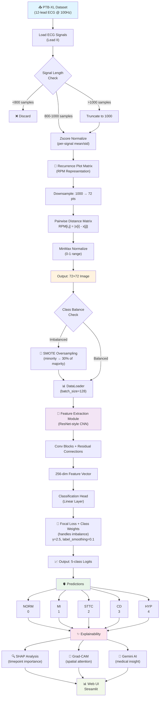

# 🫀 Abnormal ECG Signal Classification

> **AI-powered cardiac diagnostics with explainable predictions.** Detect 5 cardiovascular conditions from ECG signals using deep learning with SHAP & Grad-CAM interpretability.

[](https://www.python.org/)
[](https://pytorch.org/)
[](https://streamlit.io/)
[](https://www.gnu.org/licenses/gpl-3.0.html)
[](https://physionet.org/content/ptb-xl/1.0.1/)

---

## 🚀 Quick Start (< 5 minutes)

```bash
# 1. Clone & enter directory
git clone https://github.com/yourusername/Abnormal-ECG-signal-classification.git
cd Abnormal-ECG-signal-classification

# 2. Setup (Git LFS required for model)
git lfs install && git lfs pull
python -m venv venv && source venv/bin/activate  # Windows: venv\Scripts\activate

# 3. Install & run
pip install -r requirements.txt
cd streamlit_app && streamlit run app.py
```

🎉 **Open browser → `http://localhost:8501` → Upload ECG file or generate demo**

---

## 📋 Table of Contents

- [What This Does](#-what-this-does)
- [Features](#-features)
- [Architecture](#-architecture)
- [Installation](#-installation--setup)
- [Usage](#-usage)
- [Configuration](#⚙️-optional-gemini-ai-integration)
- [Deployment](#-deployment-to-streamlit-cloud)
- [Troubleshooting](#-troubleshooting)
- [Technical Details](#-technical-details)

---

## 🎯 What This Does

Analyzes **10-second ECG recordings** (12-lead standard) and classifies them into **5 cardiovascular conditions** with:

| Condition | Label | Detection |
|-----------|-------|-----------|
| 🟢 Normal ECG | **NORM** | Healthy baseline |
| 🔴 Heart Attack | **MI** | Myocardial Infarction |
| 🟡 ST-T Wave Changes | **STTC** | Ischemic patterns |
| 🟠 Conduction Disturbance | **CD** | Electrical pathway issues |
| 🟣 Hypertrophy | **HYP** | Cardiac enlargement |

**Key Innovation:** Uses **Recurrence Plot Matrix (RPM)** — converts 1D ECG time series into 2D spatial representations, enabling CNN to capture temporal dynamics as image features.

---

## ✨ Features

### Core Capabilities
- ✅ **Real-time Classification** — Instant results on uploaded or demo ECG signals
- ✅ **Interactive Visualization** — Plot ECG waveforms, confidence scores, probability distribution
- ✅ **Heart Rate Estimation** — Auto-calculate BPM from signal analysis
- ✅ **User-Friendly Web UI** — Built with Streamlit, zero configuration needed

### Advanced Features
- 🔍 **SHAP Explainability** — See which parts of the ECG influenced the prediction
- 🎨 **Grad-CAM Visualization** — Highlight decision regions in the RPM representation
- 🤖 **AI-Powered Explanations** — Optional Google Gemini integration for medical insights
- 📤 **Multiple Input Formats** — CSV, Apple Watch exports, Samsung Health exports

### Data Support
- Generic CSV files (signal + sampling rate)
- Apple Watch ECG exports
- Samsung Health ECG exports
- Demo generation for testing

---

## 🏗️ Architecture



**Technical Stack:**
- **Model:** PyTorch CNN with ResNet-style residual blocks
- **Loss:** Focal Loss with class-balanced weights (handles imbalanced data)
- **Optimization:** AdamW + CosineAnnealingWarmRestarts
- **Explainability:** SHAP DeepExplainer + Grad-CAM (Conv2d layer 2)
- **Framework:** Streamlit (web UI)

**Dataset:** PTB-XL (21,837 ECG records, 12-lead, 100 Hz sampling)

---

## 💾 Installation & Setup

### Prerequisites
- **Python 3.8+** (tested on 3.9, 3.10, 3.11)
- **Git** (with LFS support)
- **Git LFS** (for trained model weights ~150MB)

### Step-by-Step

**1. Clone repository**
```bash
git clone https://github.com/yourusername/Abnormal-ECG-signal-classification.git
cd Abnormal-ECG-signal-classification
```

**2. Install Git LFS** (required for `best_model.pth`)
```bash
git lfs install
git lfs pull
```
> Without this, the model loads uninitialized weights = garbage predictions.

**3. Create & activate virtual environment**
```bash
# macOS/Linux
python3 -m venv venv && source venv/bin/activate

# Windows (Command Prompt)
python -m venv venv && venv\Scripts\activate

# Windows (PowerShell)
python -m venv venv; venv\Scripts\Activate.ps1
```

**4. Install dependencies**
```bash
pip install --upgrade pip
pip install -r requirements.txt
```

✅ **Ready!** Jump to [Usage](#-usage)

---

## ⚙️ Optional: Gemini AI Integration

Enable **medical explanations powered by Google Gemini AI**.

### Setup

**1. Get API key** → [Google AI Studio](https://aistudio.google.com/app/apikey) (free tier available)

**2. Set environment variable** (choose one method)

**Option A: Environment Variable**
```bash
# macOS/Linux
export GEMINI_API_KEY="your_key_here"

# Windows (Command Prompt)
set GEMINI_API_KEY=your_key_here

# Windows (PowerShell)
$env:GEMINI_API_KEY="your_key_here"
```

**Option B: Streamlit Secrets** (recommended for Streamlit Cloud)
Create `streamlit_app/.streamlit/secrets.toml`:
```toml
GEMINI_API_KEY = "your_key_here"
```

> Add to `.gitignore` to prevent accidental commits!

**3. Run & verify**
```bash
cd streamlit_app
streamlit run app.py
```
If Gemini integration is active, "Explain with AI" button appears in the UI.

---

## 🎮 Usage

### Running Locally

```bash
cd streamlit_app
streamlit run app.py
```
Opens: `http://localhost:8501`

### 1️⃣ Upload ECG Data

**Supported formats:**
- Generic CSV (columns: sample, lead_II, etc.)
- Apple Watch `.csv` exports
- Samsung Health `.csv` exports

**Steps:**
1. Sidebar → "Upload ECG File"
2. Select device type
3. Set sampling rate (default: 100 Hz)
4. Upload your CSV

### 2️⃣ Generate Demo ECG (for testing)

**Steps:**
1. Sidebar → "Generate Demo ECG"
2. Choose: Normal or Abnormal
3. Set duration (5–60 seconds)
4. Click "Generate"

### 3️⃣ View Results

App displays:
- 📊 **ECG Waveform** — Interactive plot of the signal
- 🎯 **Classification Result** — Predicted condition + confidence %
- 📈 **Probability Distribution** — Likelihood for all 5 classes
- 🫀 **Heart Rate** — Auto-calculated BPM
- 🔍 **Explainability** (if enabled):
  - SHAP values → which timepoints mattered
  - Grad-CAM → decision regions in RPM space
  - AI Explanation → Gemini medical insights

---

## 🚀 Deployment to Streamlit Cloud

### Prerequisites
- GitHub account with repo pushed
- Git LFS enabled on repo
- (Optional) Gemini API key

### Steps

**1. Push code to GitHub**
```bash
git add .
git commit -m "Deploy ECG analyzer"
git push origin main
```

**2. Deploy on Streamlit Cloud**
- Visit [share.streamlit.io](https://share.streamlit.io/)
- Click "New app"
- Select: your repo, branch `main`, file path `streamlit_app/app.py`
- Click "Deploy"

**3. Add secrets** (if using Gemini)
- Streamlit Cloud dashboard → App settings → Secrets
- Paste:
  ```toml
  GEMINI_API_KEY = "your_key_here"
  ```

✅ **Live!** Share the app URL with users.

---

## 📁 Project Structure

```
Abnormal-ECG-signal-classification/
├── 📂 streamlit_app/               # ← Production deployment
│   ├── app.py                      # Main Streamlit web app
│   ├── model.py                    # Inference-optimized model
│   ├── best_model.pth              # Trained weights (Git LFS)
│   ├── requirements.txt            # Web app dependencies
│   └── .streamlit/
│       └── secrets.toml            # (gitignore this)
│
├── model.py                        # ← Training script (Jupyter-origin)
├── requirements.txt                # Master dependencies
├── sample.csv                      # Example ECG data
├── .gitattributes                  # Git LFS config
├── .gitignore
├── AGENTS.md                       # Development notes
└── README.md                       # This file
```

**Key notes:**
- ⚠️ **`model.py` (root):** Training-only. Contains `!pip install` commands (Jupyter syntax). 
  - Use `streamlit_app/model.py` for inference/non-notebook work.
- ✅ **`streamlit_app/`:** Production-ready deployment package.
- 📦 **Model weights:** Stored in Git LFS (`best_model.pth` ~150MB).

---

## 🛠️ Troubleshooting

### ❌ "Model file not found" / Model outputs garbage predictions

**Root cause:** Git LFS not properly configured.

**Fix:**
```bash
# Install & pull LFS files
git lfs install
git lfs pull

# Verify model exists
ls -lh streamlit_app/best_model.pth  # macOS/Linux
dir streamlit_app\best_model.pth     # Windows

# Check LFS tracking
git lfs ls-files
```

**Still broken?** Delete local repo, re-clone:
```bash
cd ..
rm -rf Abnormal-ECG-signal-classification
git clone https://github.com/yourusername/Abnormal-ECG-signal-classification.git
cd Abnormal-ECG-signal-classification
git lfs pull
```

---

### ❌ "ModuleNotFoundError" / Import errors

```bash
# Upgrade pip & reinstall
pip install --upgrade pip
pip install -r requirements.txt --force-reinstall

# On Streamlit Cloud: Force redeploy
# (Dashboard → Manage app → Reboot app)
```

---

### ❌ Streamlit Cloud deployment fails

**Checklist:**
- [ ] `git lfs pull` completed locally?
- [ ] `.gitattributes` contains: `*.pth filter=lfs diff=lfs merge=lfs -text`?
- [ ] GitHub shows "Stored with Git LFS" badge on `best_model.pth`?
- [ ] `streamlit_app/app.py` is the correct main file?
- [ ] `GEMINI_API_KEY` added to Streamlit Cloud secrets (if needed)?

**Force redeploy:**
Streamlit Cloud dashboard → Manage app → Reboot app

---

### ⚠️ Slow predictions / GPU not detected

- On CPU, inference ~2–5 seconds per ECG. This is expected.
- Streamlit Cloud runs on CPU. Use local GPU for faster processing.
- To enable GPU locally, install: `pip install torch --index-url https://download.pytorch.org/whl/cu118`

---

## 📊 Technical Details

### Model Training

**Hyperparameters:**
- Input: 1000 samples @ 100 Hz (10-second ECG)
- RPM size: 72×72 images
- Batch size: 128
- Learning rate: 1e-4
- Epochs: 200 (early stopping @ patience=15 on macro F1)
- Optimizer: AdamW + CosineAnnealingWarmRestarts

**Loss function:**
- Focal Loss (γ=2.5) with class-balanced weights
- Label smoothing (ε=0.1)
- Handles severe class imbalance

**Data augmentation:**
- Gaussian noise injection
- Amplitude scaling
- ⚠️ **NO rotation/flips** (destroys RPM semantics)

### Explainability

**SHAP (SHapley Additive exPlanations):**
- Computes contribution of each timepoint to the prediction
- Identifies which ECG segments influenced the classification

**Grad-CAM (Gradient-weighted Class Activation Mapping):**
- Highlights decision regions in the 72×72 RPM space
- Shows which spatial patterns the CNN focused on

**Why both?** SHAP → temporal explanation, Grad-CAM → spatial explanation. Together = comprehensive interpretability.

---

## 🔗 Dataset & References

**Dataset:** [PTB-XL](https://physionet.org/content/ptb-xl/1.0.1/)
- 21,837 12-lead ECG records
- 10-second recordings @ 100 Hz
- Diverse cardiac conditions with expert annotations

**Inspired by:**
> Wei Zeng, Liangmin Shan, Chengzhi Yuan, Shaoyi Du. **"Advancing cardiac diagnostics: Exceptional accuracy in abnormal ECG signal classification with cascading deep learning and explainability analysis."** *Applied Soft Computing*, 2024. https://doi.org/10.1016/j.asoc.2024.112056.

---

## ⚖️ Disclaimer

⚠️ **This is for educational and research purposes only.**

This application is **NOT a medical device** and **should NOT be used** as a substitute for professional medical advice, diagnosis, or treatment.

**Always consult qualified healthcare professionals** for any cardiac concerns.

---

## 📜 License

GNU General Public License v3.0 ([GPL-3.0](https://www.gnu.org/licenses/gpl-3.0.html))

---

## 🤝 Contributing

Contributions welcome! Feel free to:
- 🐛 Report bugs via GitHub Issues
- 💡 Suggest features
- 🔧 Submit Pull Requests

---

## 🙏 Acknowledgments

- **Dataset:** [PhysioNet](https://physionet.org/) community
- **Methods:** Inspired by Zeng et al., 2024
- **Explainability:** SHAP & Grad-CAM communities
- **Framework:** PyTorch & Streamlit teams

---

**Made with ❤️ for cardiac AI research**

Last updated: March 2026
